# RouteLedger 🚗📍

RouteLedger is a production-ready Flutter application for tracking, saving, replaying, exporting GPS routes and works even when the app is killed.

Built with scalable architecture, offline-first persistence, and clean state management using Riverpod.  
Designed to demonstrate real-world GPS tracking, background services, and production-grade Flutter engineering.

---

# 🎬 Demo


---

# 📸 Screenshots

## 🌞 Light Theme

| Home | Live Tracking | Trip Summary | Route History | Route Replay | Share / Export |
|:------------------:|:---------------------:|:------------------:|:---------------------:|:------------------:|:---------------------:|
| 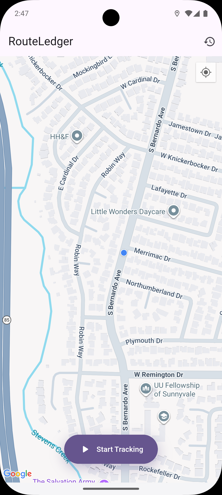 | 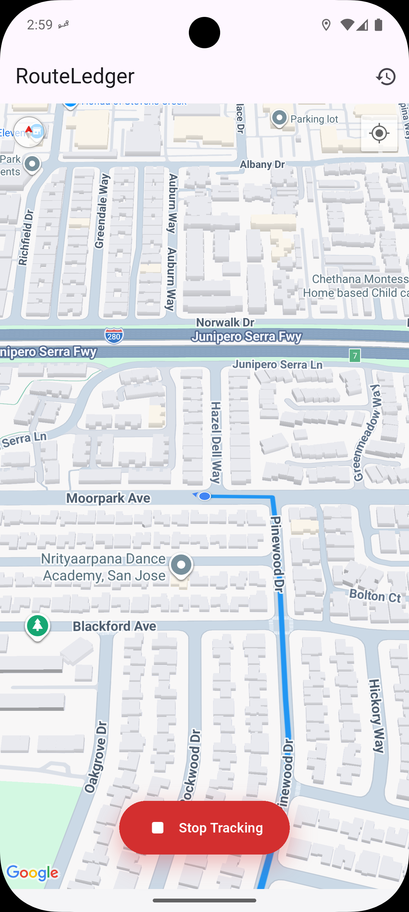 | 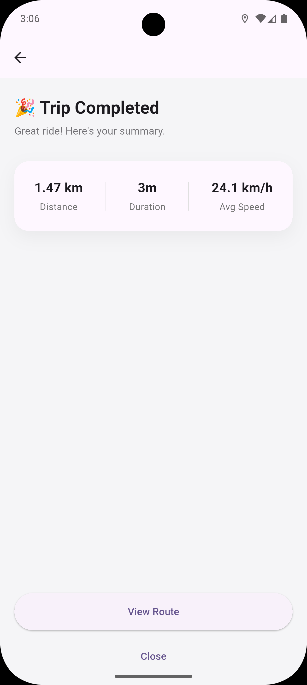 | 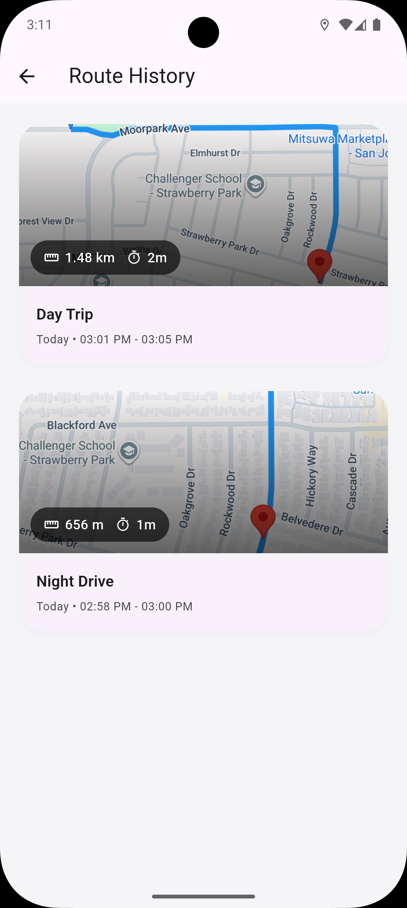 | 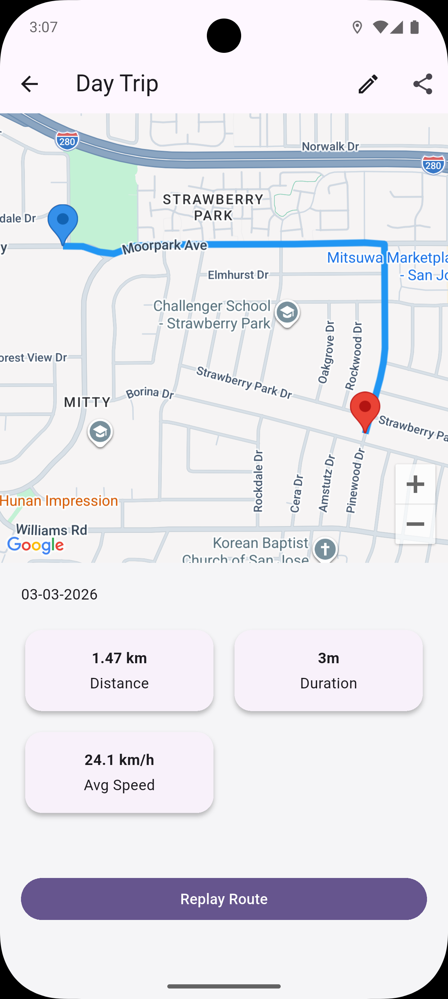 | 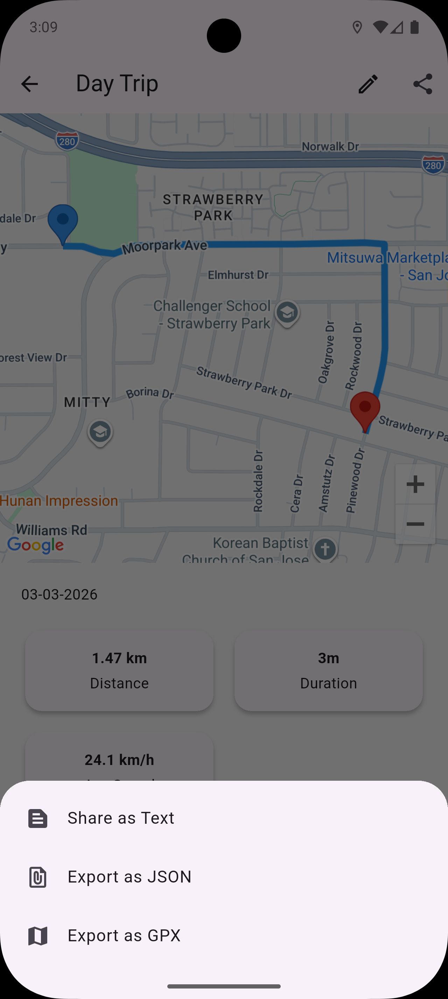 |

---

## 🌙 Dark Theme

| Home | Live Tracking | Trip Summary | Route History | Route Replay | Share / Export |
|:------------------:|:---------------------:|:------------------:|:---------------------:|:------------------:|:---------------------:|
|  |  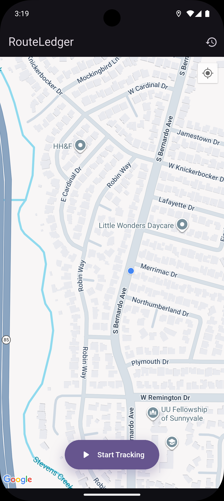 | 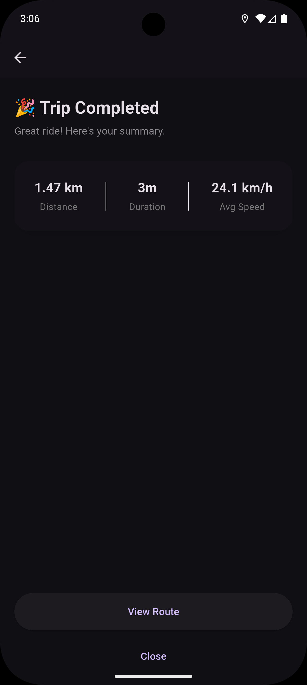 | 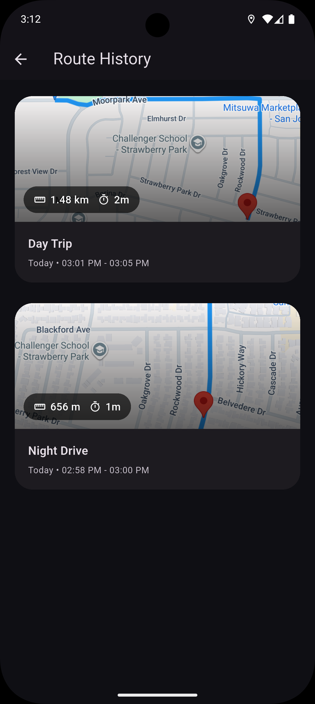 | 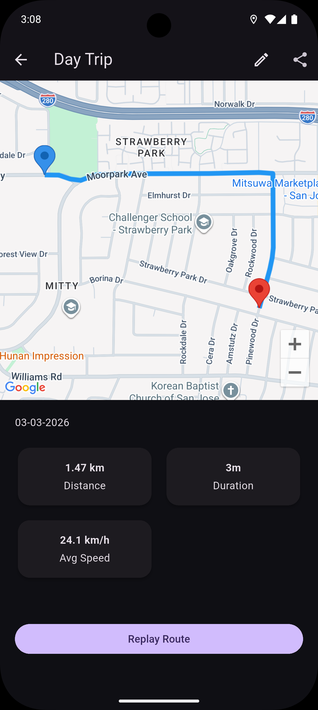 | 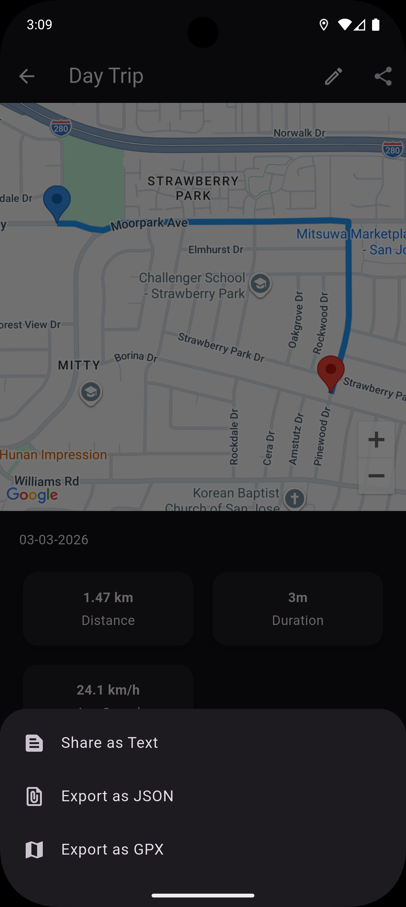 |

---

# ✨ Features

## 📍 Live Route Tracking
- Real-time GPS tracking
- Segmented polyline rendering
- Smooth camera follow
- Foreground service integration
- Background-safe isolate entry point
- Ordered runtime permission handling

## 🗺 Route History
- Fully offline persistence using Hive
- Today / Yesterday smart labels
- Auto-fit camera bounds
- Swipe-to-delete with confirmation & UNDO
- Riverpod-powered auto refresh

## 📊 Trip Summary
- Distance calculation via Google Directions API
- Duration tracking
- Average speed calculation
- Post-trip summary screen
- Async route enrichment

## 🎬 Route Replay
- Interpolated animated polyline
- Moving marker animation
- Smooth camera follow
- Auto-center on completion

## ✏️ Route Management
- Auto-generated route names
- Rename with instant UI update
- Provider invalidation for state sync

## 📤 Export & Sharing
- Share trip summary as text
- JSON export
- GPX export (GPS device compatible)
- File sharing via share_plus

## 🎨 UI & UX
- Material 3 design system
- Light & Dark theme (ThemeMode.system)
- Custom shimmer loading skeleton
- Hero transitions
- Micro-interactions
- Production-level polish

---

# 🏗 Architecture Overview

RouteLedger follows a clean, layered architecture with clear separation of concerns.

Presentation Layer (UI)
↓  
Riverpod Providers  
↓  
Controllers / Services  
↓  
Local DataSource (Hive)  
↓  
External APIs (Google Directions)

Key principles:
- State-driven architecture (no navigation-based refresh hacks)
- Offline-first persistence
- Async enrichment for route metrics
- Provider invalidation for consistent UI updates
- Clean separation between UI and business logic

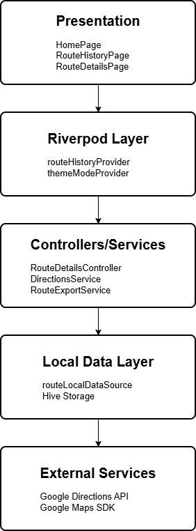

---

# 📁 Project Structure
```bash
lib/
│
├── core/
│ ├── background/ # Foreground service & background isolate
│ ├── services/ # Directions API, Export, Storage
│ ├── theme/ # AppTheme + Theme provider
│ └── utils/ # Distance, route naming utilities
│
├── data/
│ ├── local/ # Hive datasource
│ └── models/ # RouteModel, LatLngModel
│
├── presentation/
│ ├── history/ # Route history feature
│ ├── route_details/ # Replay + route details
│ ├── summary/ # Trip summary
│ └── home_page.dart # Tracking entry point
│
└── main.dart
```

---

# 🛠 Tech Stack

- Flutter
- Dart
- Riverpod
- Google Maps SDK
- Google Directions API
- Hive (local storage)
- share_plus
- Android Foreground Service

---

# 🧠 Production Considerations

- Secured API key usage
- Ordered runtime permission handling
- GPS & notification permission management
- Background-safe entry points (vm:entry-point)
- Clean provider lifecycle management
- No navigation-dependent state refresh
- Offline-first architecture

---

# 🚀 Potential Improvements

- Cloud sync (Firebase / Supabase)
- Multi-device backup
- Route tagging & categorization
- Analytics dashboard
- Web dashboard
- iOS background tracking support

---

# 👨‍💻 Developer

Ashique KP  
Flutter Developer  
Clean Architecture • Offline-First Apps • Production-Ready Systems

---

# 📄 License

This project is for portfolio and demonstration purposes.
